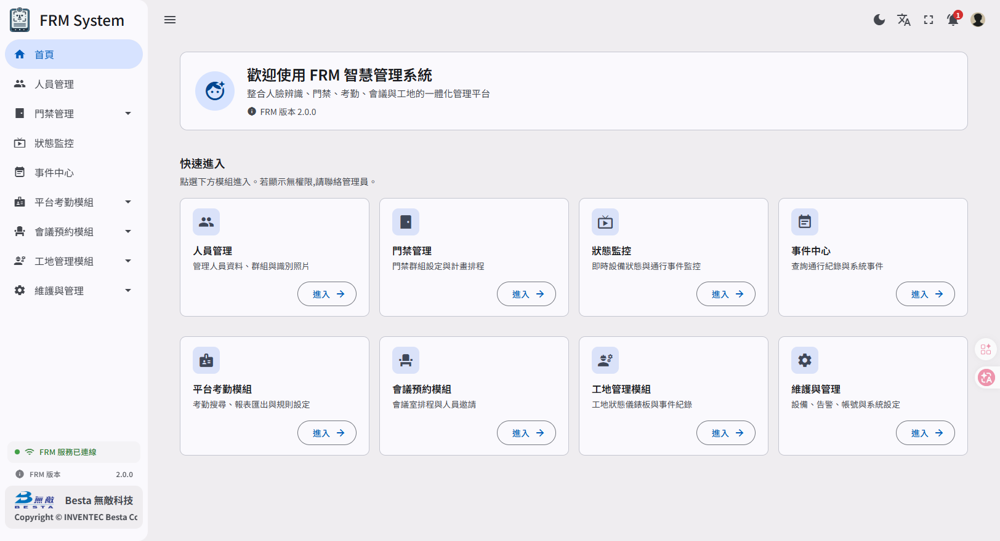

  

<h1 align="center">FRM System</h1>

  <strong>人臉辨識智慧管理平台</strong> 
  整合門禁、考勤、會議、工地，一站式智慧化管理

  <a href="./website/index.html"><b>瀏覽官方介紹網站 →</b></a>

 

  

---

## 為您的場域打造智慧管理新世代

FRM System 是無敵科技推出的人臉辨識整合管理平台，將
**門禁、考勤、會議與工地安全**統合於同一後台。
透過模組化授權設計，您可以依需求彈性配置功能、隨業務成長逐步擴充，
從中小型場域到多廠區、多設備皆能靈活對應。

 

## 為什麼選擇 FRM

| | |
| :-- | :-- |
| **一站式整合管理** | 門禁、考勤、會議與安全業務統合於同一後台。一組帳號、一套權限，現場狀況即時掌握，省下切換多套系統的時間。 |
| **模組化彈性授權** | 考勤、會議、工地管理等模組獨立授權，您只為實際使用的功能付費。隨業務成長隨時啟用新模組，無需重新部署。 |
| **多元場域應用** | 從企業辦公大樓、社區門禁、工地廠區、校園出勤到醫療機構，FRM System 已在多種產業場域穩定運行。 |

 

## 模組總覽

平台共有 **13 項專業模組**，分為核心與加值兩大類。

### 核心模組（標準內建）

| 模組 | 說明 |
| :-- | :-- |
| 狀態監控 | 即時辨識事件流、門禁狀態與裝置在線監測 |
| 人員管理 | 人員資料庫、人臉照片建模、群組與部門管理 |
| 門禁管理 | 門禁裝置綁定、通行時段、群組通行規則 |
| 事件中心 | 全量辨識事件與進出記錄查詢、影像回放 |
| 告警通知 | 告警群組、規則化觸發條件、多通道通知 |
| 維護與管理 | 設備、系統紀錄、帳號 / 權限細粒度管理 |

### 加值模組（依需求授權）

| 模組 | 說明 |
| :-- | :-- |
| 平台考勤模組 | 班別 / 加班 / 遲到早退自動計算與報表 |
| 會議預約模組 | 會議室預約、人臉自動簽到、出席統計 |
| 工地管理模組 | 工地進出管理、廠商人員管控、Dashboard 大屏 |
| 異地資料庫模組 | 提供資料庫推送介面，供客戶端自行串接 |
| 異地 API 模組 | 提供 RESTful 推送介面與 API 規格文件 |
| 自動匯出模組 | 定時將辨識資料匯出為 TXT 至指定路徑 |
| Deltapath 電話告警模組 | 重要事件透過 Deltapath 發出電話告警 |

 

## 智慧終端

搭配無敵科技自有的 **PK-FIT5 系列人臉辨識終端**與**智慧刷卡機**，
外型俐落、辨識精準、防水防塵，從室內到戶外都能穩定運作。

| 終端 | 重點規格 |
| :-- | :-- |
| **PK-FIT5 系列人臉辨識終端** | 7 吋觸控螢幕 · 2MP 廣角雙鏡頭 · 辨識 < 0.2 秒 · 5,000 筆人臉資料庫 · IP65 防水防塵 · -30°C ~ +60°C |
| **智慧刷卡機** | 感應式刷卡認證 · 可與人臉辨識終端混合部署 · 適用以卡片為主要驗證方式的場域 |

 

## 授權方案

FRM System 提供三種授權形式，對應不同階段的需求：

| 版本 | 適用情境 |
| :-- | :-- |
| **試用版本** | 限定期間完整功能試用，方便採購前評估與驗證 |
| **年訂閱版本** | 以年為單位授權，初期投入較低，規模可逐年彈性調整 |
| **永久版本** | 一次性買斷，永久使用無到期日，適合長期穩定部署 |

> 所有授權版本的報價皆依「**場域人數**」與「**設備數量**」而定。
> 請聯絡業務團隊提供您的場域資訊，我們將為您量身規劃合適的方案與報價。

 

## 服務範疇

不只交付軟體，從場域評估到落地我們皆可協助：

- **硬體架構規劃** — 機房配置、伺服器選型、終端佈點建議
- **網路規劃** — 區網架構、頻寬評估、VLAN 與資安規劃
- **線路規劃** — 佈線路徑、線材選用、機櫃整線
- **電力規劃** — 用電負載評估、UPS 配置、迴路規劃
- **系統整合（SI）** — 跨系統介接、現場驗收、教育訓練

 

## 聯絡我們

### 業務洽詢 · 預約展示

希望了解產品、評估授權方案，或安排線上 / 現場展示。

- **電子郵件**：[eisd_sales@besta.com.tw](mailto:eisd_sales@besta.com.tw)
- **電話**：+886-2-8797-5111

### 技術支援

既有客戶遇到部署、升級、模組設定相關問題。

- **電子郵件**：[softwareservice@besta.com.tw](mailto:softwareservice@besta.com.tw)
- **支援電話**：+886-2-8797-5111
- **支援時段**：週一至週五 09:00 – 18:00（UTC+8）

 

---

  

  © BESTA · 無敵科技股份有限公司

